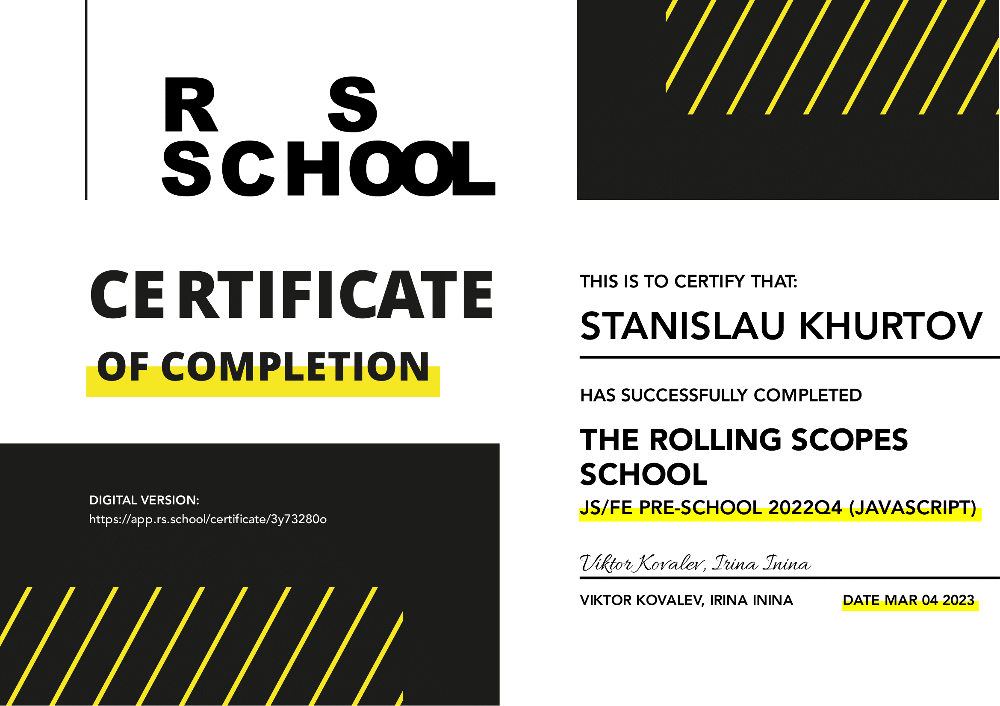
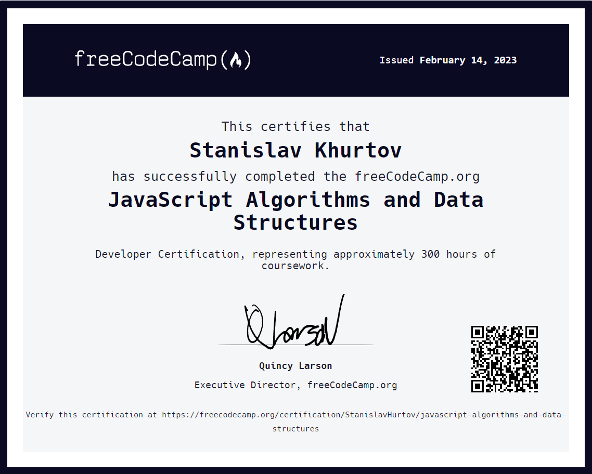
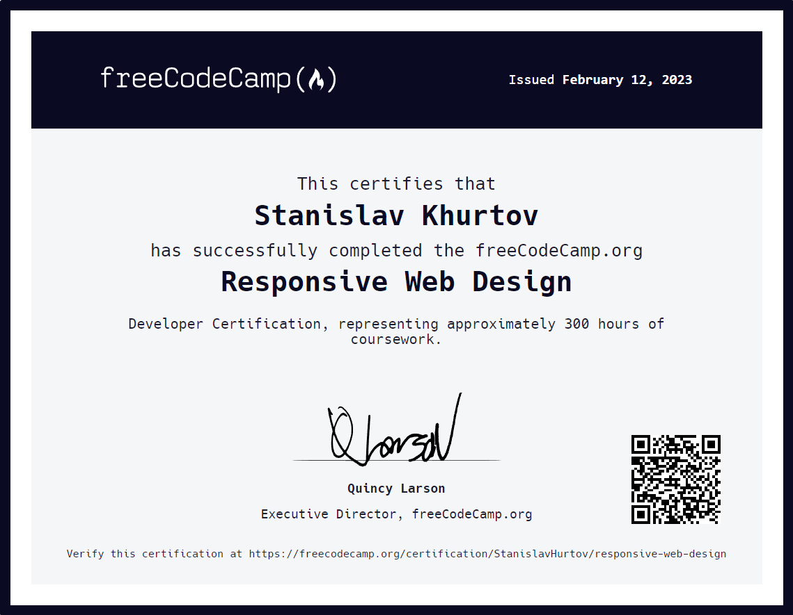

    

 

Stanislav Khurtov

Frontend developer

 

### ***About me***

> #### I have extensive skills in developing web applications using [React](https://react.dev/) and [TypeScript](https://www.typescriptlang.org/). I have a deep understanding of the core principles and concepts of React, such as components, state, component lifecycle, and state management. I'am also familiar with key libraries and tools widely used in the React ecosystem, such as [React Router](https://reactrouter.com/en/main), [Redux](https://redux.js.org/), and [Axios](https://axios-http.com/docs/intro).

> #### My experience with React includes building scalable and reusable components, managing data using state and context, and interacting with external <u>APIs</u>. I also have experience working with [React Hooks](), which help simplify state management and improve component performance.

> #### I actively leverage TypeScript in my React projects to ensure type safety and enhance development. I am familiar with key TypeScript concepts, such as >data types, interfaces, generics, and decorators. Using TypeScript allows me to catch errors during development, improve code autocompletion and documentation, and enhance codebase understanding for effective teamwork.

> #### Additionally, I possess development skills in <u>HTML5</u>, <u>CSS3</u>, and <u>Sass (SCSS)</u>. I prioritize semantic and accessible web pages, create responsive layouts using media queries, and follow the <u>BEM</u> methodology for styling organization. I am proficient in creating animations and utilizing modern CSS features, such as <u>Grid Layout</u> and <u>Flexbox</>. Furthermore, I have experience working with design tools like <u>Figma</u>, <u>dobe Photoshop</u>, and <u>Pixso</u> enabling me to create visually appealing user interfaces based on provided designs.

> #### Overall, my skills in React and TypeScript enable me to develop modern, scalable, and maintainable web applications with enhanced reliability and performance. I continuously update my knowledge and adhere to best development practices to ensure high-quality work.

 
 

### ***Skills and Tools:***

 

 
 
 
 

- React / Redux / Redux Toolkit
- JavaScript / TypeScript
- Axios / Rest API / Swagger
- HTML / CSS / BEM
- SASS / SCSS
- Formik / React Hook Form
- Material UI / Ant Design / Styled Components
- TDD / Unit test / Jest / Storybook
- Git / GitHub / Gitlab
- Figma / Adobe Photoshop / Pixso
- Webpack

 
 

### ***Project Case***

### [***Portfolio*** ](https://stanislavkhurtov.netlify.app/)

 

### [***Travel*** - website of tourist services](https://stanislavkhurtov.github.io/Travel-ver.2)

 

### [***Porten*** - accessories sale website](https://stanislavkhurtov.github.io/Porten/home.html)

 

### [***Aperture*** - photo studio website](https://stanislavkhurtov.github.io/Aperture)

#

### ***Сertificate***

 

 

 
 

#

### ***Contact me***

 

[
***__Telegram***](https://t.me/+375257687065/)
 

[
***__Linkedin***](https://www.linkedin.com/in/stanislav-khurtov-4b1002228/)
 

<a href="mailto:skhurtov@yandex.ru">
***Say Hello***</a>

