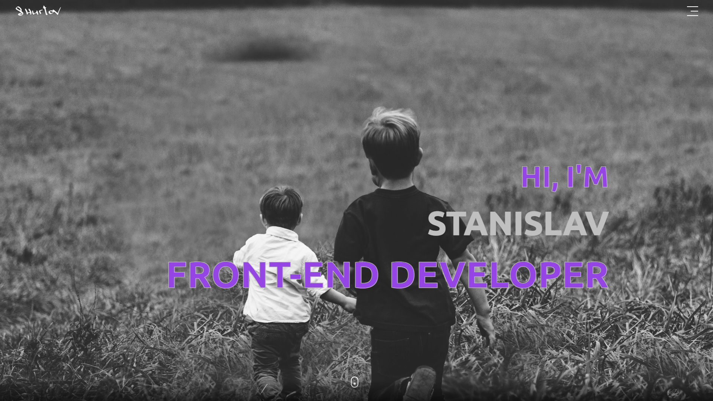
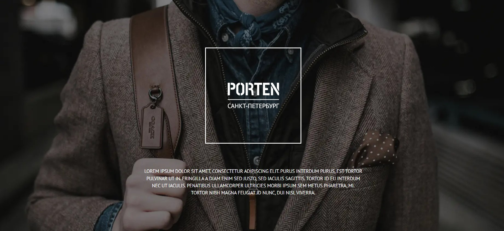
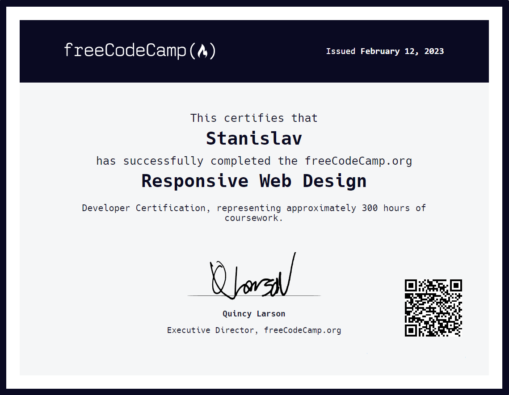
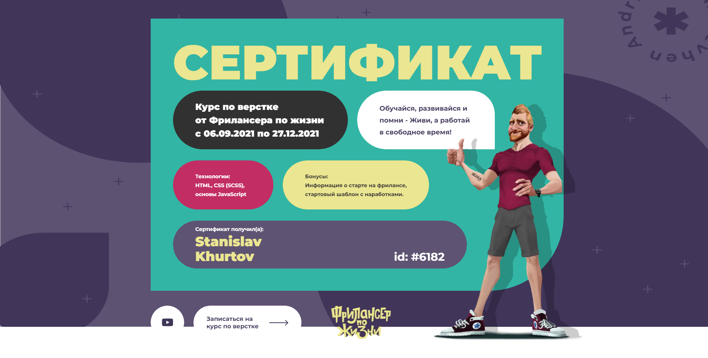

 

# ___***Hi, My name is Stanislav!***___

### ***I'am frontend developer***
#
### ***About me***

#### I have a serious passion for UI effects, animations and creating intuitive, dynamic user experiences. I am a real hard worker and constantly experimenting with new techniques and tools.
My layouts work on any device, big or small. Websites don't have to be static, I like to make pages come alive.
If you think we should co-create something awesome together, let me know!
Currently open to new opportunities and looking for a team, I look forward to sharing my skills. I am available to work remotely on a freelance basis.

#
### ***Skills and Tools***

#

 
 
 

#### **HTML5** - semantics, accessibility, cross-platform, reliability;
 #### **CSS3** - I use a bunch of Grid Layout && Flexbox, create animations, create adaptive layout using media expressions, use BEM methodology, PerfectPixel;
 #### **Sass(SCSS)** - I use mixins, cycles, conditions and variables;
 #### **Javascript** - (ES6 standards; I know basic JS data structures, I know how to work with asynchronous functions, I have DOM skills);
 #### **Figma, Adobe Photoshop, Pixso** - I make up according to the presented layout;
 #### **React** - learning the basics;

#

### ***Learning***

#

 
 
 

#

### ***Codewars***

#

### ***Project Case***
 

####  [***Portfolio*** ](https://main--resplendent-paprenjak-7743d6.netlify.app/) 

 

####  [***Travel*** - website of tourist services](https://stanislavkhurtov.github.io/Travel-ver.2) 

 

#### [***Porten*** - accessories sale website](https://stanislavkhurtov.github.io/Porten/home.html)

 

#### [***Aperture*** - photo studio website](https://stanislavkhurtov.github.io/Aperture)

#

### ***Сertificate***
 

 
  

#

### ***Statistics***
 

 

 

### ***Contact me***
 

[***__Telegram***](https://t.me/+375257687065/)
 

[***__Linkedin***](https://www.linkedin.com/in/stanislav-hurtov-4b1002228/)
 

<a href="mailto:skhurtov@yandex.ru">***Say Hello***</a>

