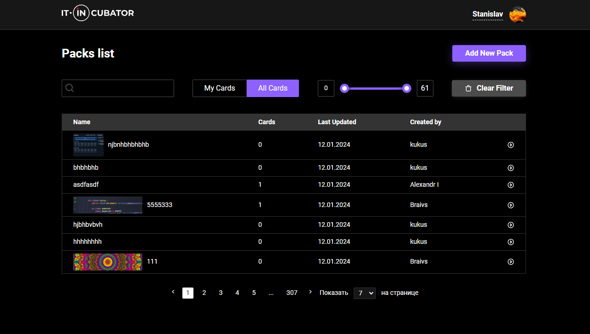
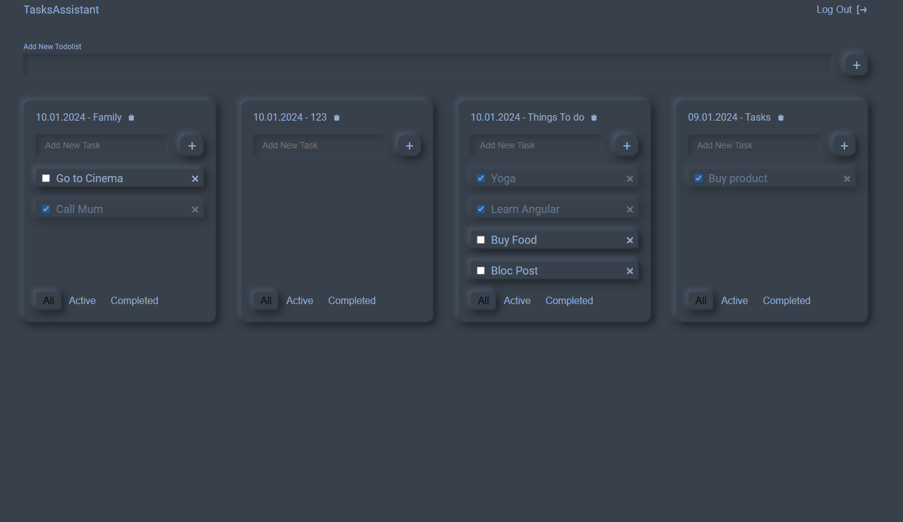
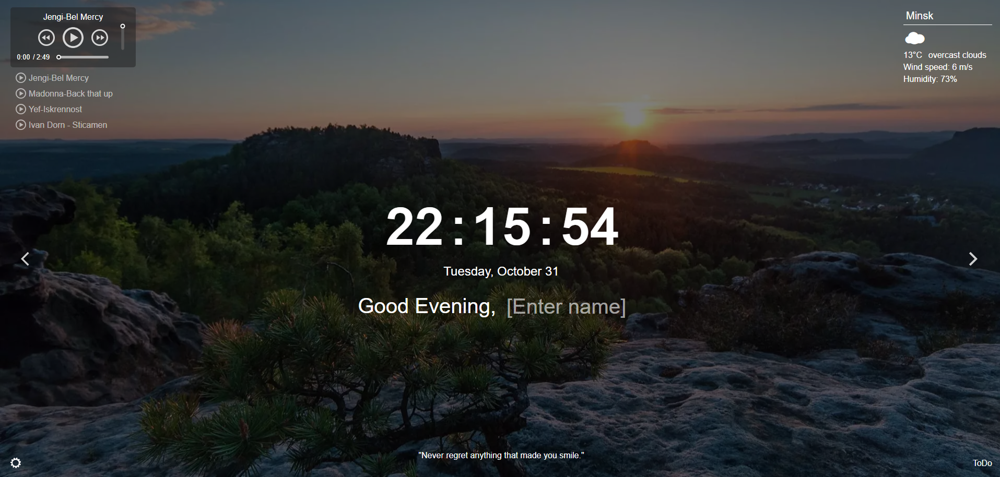
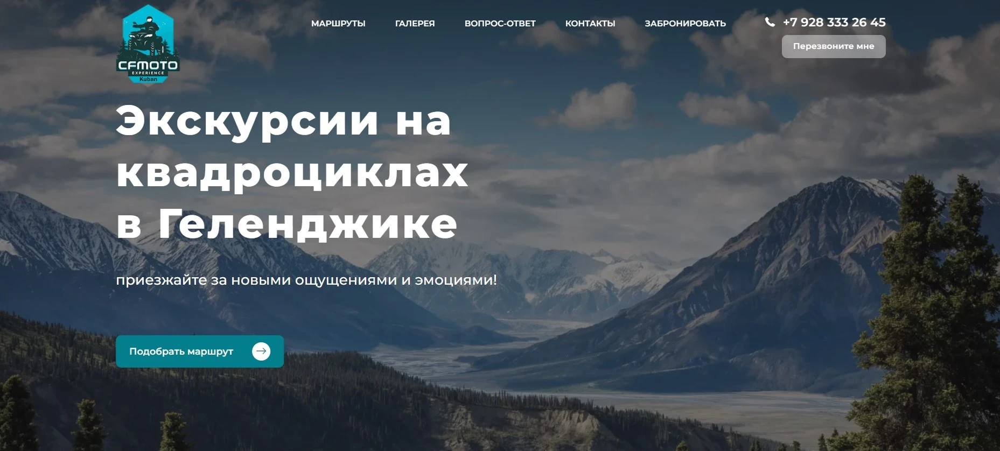
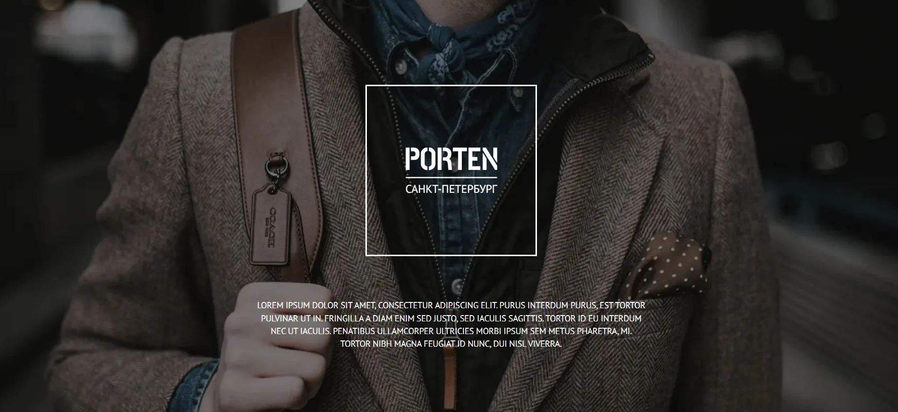
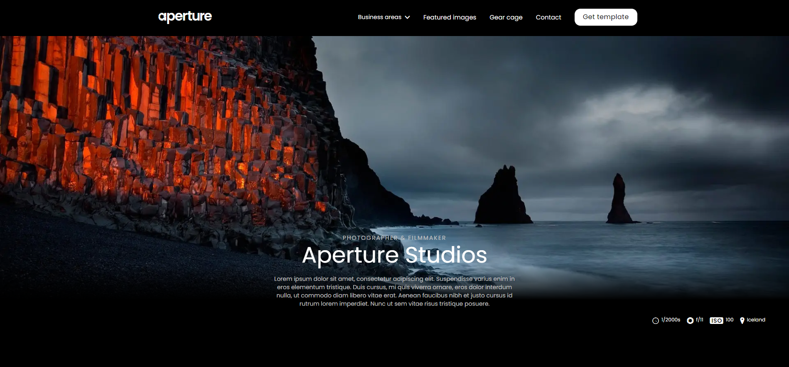

    

 

Stanislav Khurtov

Front-end developer

### [**CV - ru**](https://disk.yandex.ru/i/pZt1ykQUFe4AVw)
### [**CV - en**](https://stanislavkhurtov.github.io/Resume/)

 

### ***About me***

> #### I have extensive skills in developing web applications using React and TypeScript. I have a deep understanding of the core principles and concepts of React, such as components, state, component lifecycle, and state management. I'am also familiar with key libraries and tools widely used in the React ecosystem, such as React Router, Redux, and Axios.

> #### My experience with React includes building scalable and reusable components, managing data using state and context, and interacting with external APIs. I also have experience working with React Hooks, which help simplify state management and improve component performance.

> #### I actively leverage TypeScript in my React projects to ensure type safety and enhance development. I am familiar with key TypeScript concepts, such as data types, interfaces, generics, and decorators. Using TypeScript allows me to catch errors during development, improve code autocompletion and documentation, and enhance codebase understanding for effective teamwork.

> #### Additionally, I possess development skills in HTML5, CSS3, and Sass (SCSS). I prioritize semantic and accessible web pages, create responsive layouts using media queries, and follow the BEM methodology for styling organization. I am proficient in creating animations and utilizing modern CSS features, such as Grid Layout and Flexbox. Furthermore, I have experience working with design tools like Figma, Adobe Photoshop, and Pixso enabling me to create visually appealing user interfaces based on provided designs.

> #### Overall, my skills in React and TypeScript enable me to develop modern, scalable, and maintainable web applications with enhanced reliability and performance. I continuously update my knowledge and adhere to best development practices to ensure high-quality work.

 
 

### ***Skills and Tools:***

 

 
 
 
 

- JavaScript / TypeScript
- React / Redux / Redux Toolkit / RTK Query
- Axios / Rest API / Swagger / Postman
- HTML / SCSS / BEM
- React Hook Form / Formik
- Material UI / Ant Design / Styled Components
- TDD / Unit test / Jest / Storybook
- Git / GitHub / Gitlab
- Figma / Adobe Photoshop / Pixso
- Webpack / Vite

 
 

### ***Project Case***

### [**Flash Cards**](https://flashcards-project-kappa.vercel.app/)

    
Flash Cards project, an innovative card-based learning application.

     
Our development team has focused

     
on creating a powerful and easy to use tool that 

     
will help you memorise information effectively

     
and improve your learning efficiency.

[**Project repository**](https://github.com/StanislavKhurtov/flashcards-project)

 

 
 

### [**Task Assistant**](https://task-assistant-ver-ii.vercel.app/)

    
Task Assistance is an intuitive and powerful application designed 

     
specifically to make organising and completing tasks 

     
easier. Whether you are a busy professional, a student or 

     
just a planning enthusiast, our app will help you manage your

     
tasks efficiently and achieve your goals.

[**Project repository**](https://github.com/StanislavKhurtov/Task-Assistant-ver.II)

 

 
 

### [**Momentum**](https://momentum-project-case.netlify.app/)

    
The basic idea behind Momentum is to provide you with a personalized 

     
start page that inspires you and helps you manage your time and tasks. 

     
When you launch the app, you are greeted by a simple and elegant 

     
interface with a unique background image showing an inspiring photo

     
or nature picture.

[**Project repository**](https://github.com/StanislavKhurtov/Momentum)

 

 
 

### [**Portfolio**](https://stanislavkhurtov.netlify.app/)

    
This project is a responsive design and 

     
animation portfolio created to showcase skills,

     
projects and achievements. It is designed using modern technologies

     
and approaches to provide an attractive and smooth user experience.

[**Project repository**](https://github.com/StanislavKhurtov/Showcase)

 

 
 

### [**Travel**](https://stanislavkhurtov.github.io/Travel-ver.III/)

The Travel website is an attractive and

modern resource for all travel enthusiasts.

Responsive design, modern technology, eye-catching

animations and a user-friendly experience make this site an ideal source

of information and inspiration for anyone who

dreams of new adventures and discoveries.

[**Project repository**](https://github.com/StanislavKhurtov/Travel-ver.III)

 

 
 

### [**Porten**](https://stanislavkhurtov.github.io/Porten/)

The men's accessories website is a responsive resource.

The combination of modern design elements, eye-catching photography

and intuitive navigation creates an inviting and prestigious atmosphere. 

The technology stack, incorporates cutting edge tools and approaches. 

This allows for a responsive design that easily adapts to a variety of 

devices and screens.

[**Project repository**](https://github.com/StanislavKhurtov/Porten)

 

 
 

### [**Aperture**](https://stanislavkhurtov.github.io/Aperture)

The site is designed using modern technology and innovative 

approaches to provide an attractive and sleek user experience. The use 

of modern CSS and JavaScript technologies allows to add dynamism

and impact to the site content, creating interactive elements that 

emphasize unique features.

[**Project repository**](https://github.com/StanislavKhurtov/Aperture)

### ***Contact me***

 

[
***__Telegram***](https://t.me/+375257687065/)
 

[
***__Linkedin***](https://www.linkedin.com/in/stanislav-khurtov-4b1002228/)
 

<a href="mailto:skhurtov@yandex.ru">
***Say Hello***</a>

